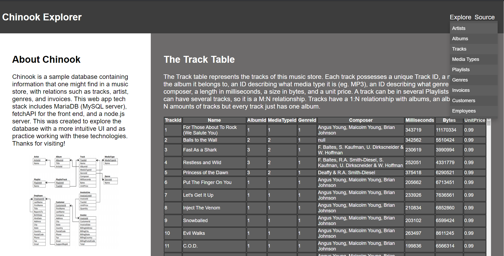

# Chinook Explorer
This database viewer is currently equipped to use a mySQL server running on the same machine as the server. This server also has static files and javascript files to give to clients with web browsers. This database viewer currently has querying capabilities to the mySQL server by JSON.

Here is the home page a UI to interact with a server's database.

Here is an example of the exploration that is offered. An explanation and table view of every major relation of the database (Track shown below).

## Motivation
This project was a great opportunity to learn REST and develop some web dev experience. Notable dependencies are node.js's mySQL and node.js's express. Front end is just html/css/js, post requests made through a Fetch API. It was really fun to learn all these technologies and it feels like I just scratched the surface.

## Future updates
-UI elements (query keyword coloring)
-UX elements (introduction to each table)
-Summary of table

